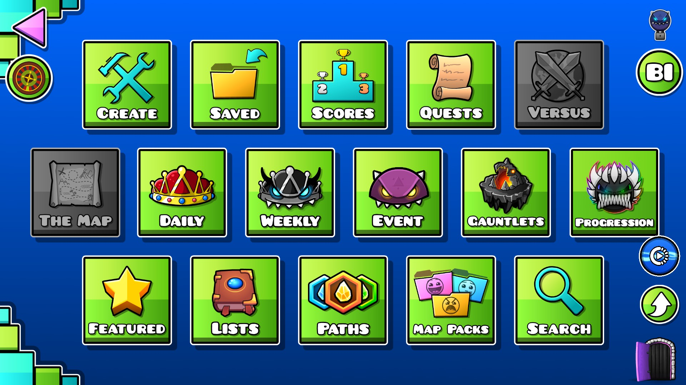
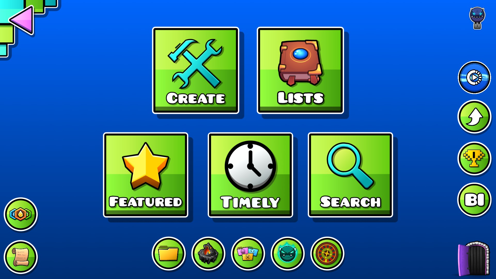

# Reworked Creator Layer

Ever got Annoyed at how many **Buttons** there are in the creator layer? Well I made a mod just for you to change that! This mod Moves around some buttons in the Creator Layer and compacts them.

# Incompatibilities

This mod is known to be **Incompatible** with the Goodbye Unused Buttons mod (because the developer changes the size of the creator buttons menu and makes it *strange*) and the Bring Back 1.6! mod... obviously...

# Contribution

If you encountered an issue or incompatibility with the mod or simply want to give a suggestion, you can tell me on the [Issues Tab of My GitHub Page](https://github.com/LofracotestinoGD/Better-CreatorLayer/issues). Help would be greatly appreciated!

# Special Thanks

- HUGE Thanks to Fryy_55, Nwo5 and Alphalaneous for Helping Me Create My First Mod!
- As well as NyteLyte for the code Rework!!

# Preview

Without The Mod:

With The Mod:

